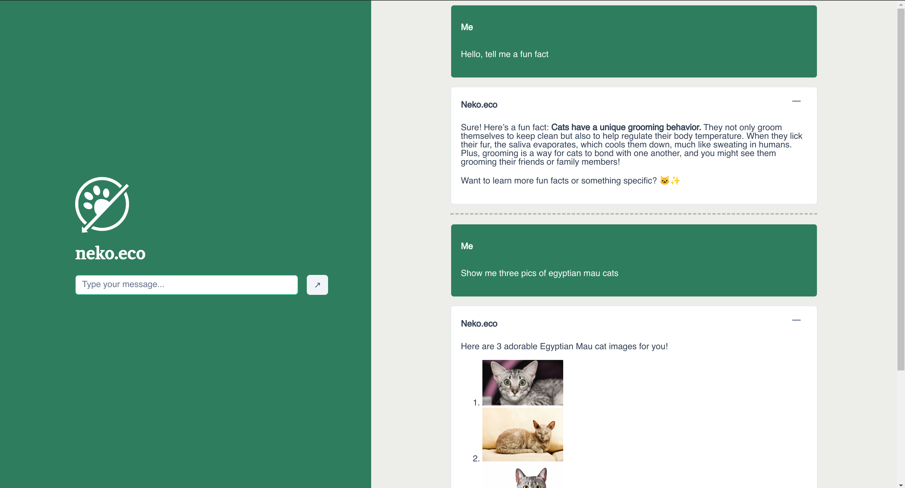

# Neko.eco

Neko.eco is a Vue.js application integrated with OpenAI's Assistants API to provide a chatbot interface. The application allows users to interact with an AI assistant and fetch random cat images using CatAPI based on user input. The backend is built with Node.js and Express, handling API requests and interactions with OpenAI's API.

All four core tasks have been implemented, along with the 'Breeds and Number of Cats' bonus. Owing to a lack of time, the streaming bonus has not been implemented.

## Code Structure

### Backend

- `backend/`
  - `.env`: Environment variables for the backend.
  - `breeds.json`: JSON file containing cat breed information.
  - `scripts/`: Python scripts for managing assistants and threads.
  - `server.js`: Main server file handling API requests and interactions with OpenAI.

### Frontend

- `my-vue-app/`
  - `index.html`: Main HTML file for the Vue app.
  - `public/`: Public assets like custom fonts and favicon.
  - `src/`: Source files for the Vue app.
    - `components/HelloWorld.vue`: Main component for the chatbot interface.
    - `main.js`: Entry point for the Vue app.

## Development Process

1. **Project Setup**: Initialized the Vue.js project using Vite and set up the backend with Node.js and Express.
2. **Integrate OpenAI API**: Integrated OpenAI's Assistants API to handle chat interactions.
3. **Integrate CatAPI**: Tested catAPI functionality manually, then used OpenAI's Function Calling capability to automate this. 
4. **Styling**: Developed Vue components for the chatbot interface and integrated PrimeVue for UI components. Applied custom styles and fonts to enhance the UI.
5. **Testing**: Tested the application to ensure smooth interactions and correct API responses.

## Possible Future Improvements

1. **Interactive Assistant/Thread Creation**: Implement a UI to allow users to create and manage assistants and threads interactively.
2. **Image Gallery/Grid**: Capture and display images in a gallery or grid format for better visualization. Did not do this right now because the current code simply renders images in markdown. 
3. **Responsive UI**: Enhance the UI to be fully responsive and mobile-friendly.
4. **Dockerize**: Create Docker configurations to containerize the application for easier deployment and scalability.

